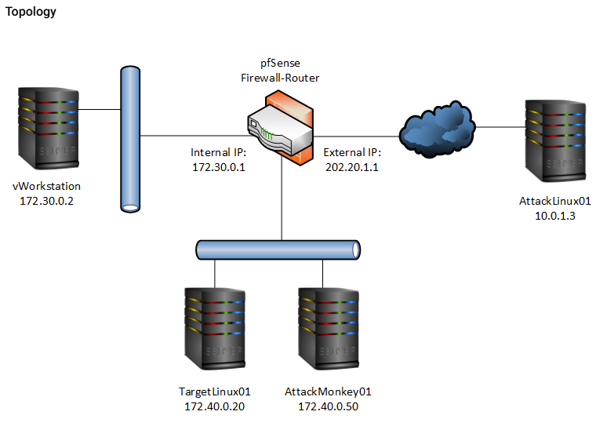
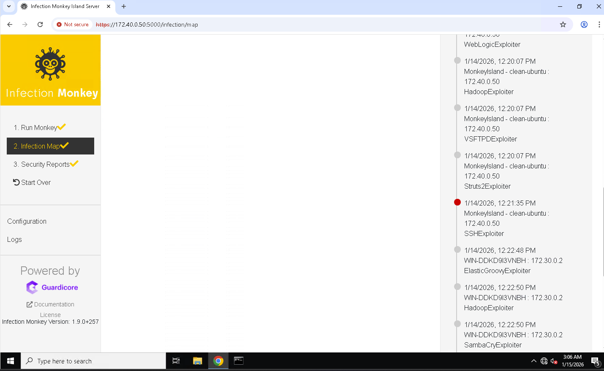
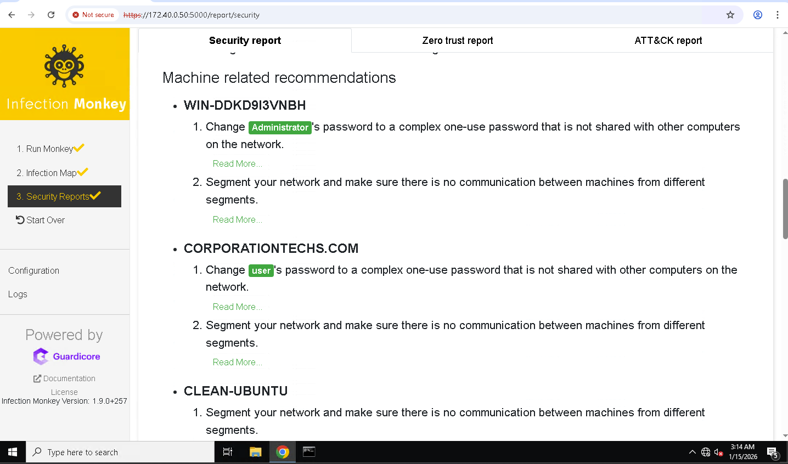
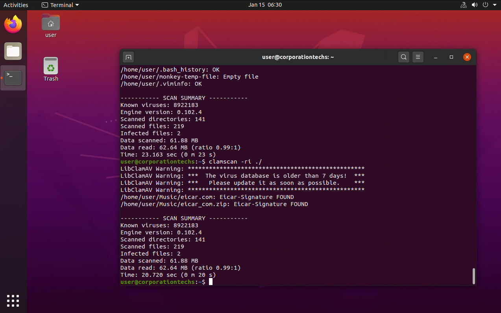
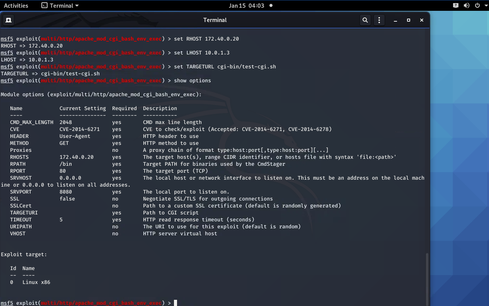
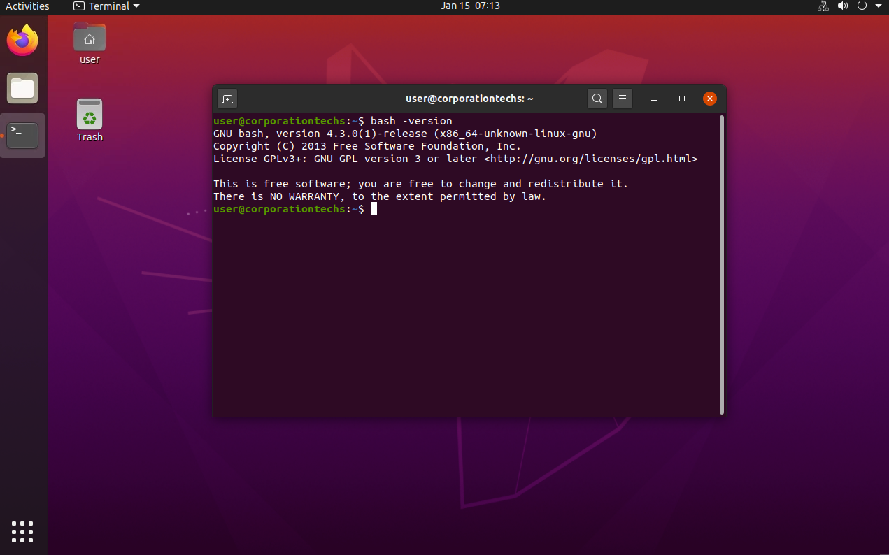

# Cybersecurity Lab: Network Attack Simulation & Defense

## Overview

This lab demonstrates a full end-to-end cybersecurity lifecycle by simulating realistic network attacks, detecting compromised systems, and applying effective remediation techniques across both Linux and Windows environments. By combining automated attack simulation with manual exploitation, the lab emphasizes how understanding attacker behavior directly strengthens defensive capabilities.

The exercise follows the defensive principle of **“know your enemy”**—by reproducing real-world attack techniques, defenders can better identify weaknesses, validate security controls, and harden systems against future threats.

---

## Lab Objectives

- Simulate real-world cyberattacks within a segmented enterprise-style network
- Observe attacker behavior across reconnaissance, exploitation, and post-exploitation phases
- Detect malicious activity using host-based security tools
- Contain and remediate compromised systems
- Validate mitigation effectiveness through re-testing
- Map observed attack techniques to the MITRE ATT&CK framework

---

## Lab Environment & Network Topology

The lab was conducted in a fully virtualized environment protected by a **pfSense firewall/router**. Network segmentation was implemented to reflect a realistic enterprise architecture with internal systems, attacker infrastructure, and external access paths.

### Key Systems

- **pfSense Firewall/Router** – Network segmentation, routing, and traffic control  
- **AttackMonkey01 (172.40.0.50)** – Infection Monkey island server  
- **TargetLinux01 (172.40.0.20)** – Linux attack target  
- **vWorkstation / Windows Host (172.30.0.2)** – Windows client system  
- **AttackLinux01 (10.0.1.3)** – External attacker system (Metasploit)

*Figure 1: Segmented lab network topology.*

---

## Section 1: Automated Attack Simulation (Infection Monkey)

### 1.1 Attack Configuration

Infection Monkey was configured to simulate a broad range of adversarial behaviors aligned with the **MITRE ATT&CK framework**. These configurations allowed the platform to mimic realistic attacker tradecraft.

*Figure 2: Infection Monkey attack configuration and target scope.*

Enabled techniques included:
- Network scanning and service discovery
- Credential access attempts
- Lateral movement
- Command-and-control communication
- Remote file transfer

---

### 1.2 Infection Map & Lateral Movement

*Figure 3: Visual infection map showing compromised hosts and lateral movement.*

The infection map clearly illustrated:
- Initial access vectors
- Exploited services
- Lateral movement paths between hosts
- Command-and-control communication links

Logs confirmed successful compromise and movement across both Linux and Windows systems.

---

### 1.3 Security & MITRE ATT&CK Reporting

*Figure 4: Infection Monkey attack summary report.*

*Figure 5: MITRE ATT&CK technique mapping.*

*Figure 6: Security risk assessment and remediation guidance.*

These reports highlighted:
- Successfully executed ATT&CK techniques
- Failed or blocked attack attempts
- Security weaknesses such as exposed services and weak credentials
- Recommended defensive improvements

---

## Section 1 (Part 2): Linux Detection & Containment (ClamAV)

Following the attack simulation, host-based detection was performed on the Linux target.

*Figure 7: Recursive ClamAV scan execution.*

*Figure 8: Detection of EICAR test malware.*

Key response actions:
- **ClamAV** identified EICAR test malware (`eicar.com`, `eicar_com.zip`)
- Scan summaries documented infected files and scan statistics
- A dedicated quarantine directory was created

*Figure 9: Quarantined malicious files.*

This demonstrated a standard Linux incident response workflow:  
**detect → isolate → verify**

---

## Section 2: Manual Exploitation (Metasploit – Shellshock)

To complement automated attacks, a manual exploitation was conducted using Metasploit.

*Figure 10: Metasploit Shellshock module discovery.*

### 2.1 Exploit Discovery & Configuration

The **Shellshock vulnerability (CVE-2014-6271 / CVE-2014-6278)** was targeted via Apache CGI.

*Figure 11: Exploit configuration including RHOST, LHOST, and TARGETURI.*

- Target, attacker, and CGI paths were defined
- Payloads were reviewed and selected appropriately

---

### 2.2 Exploitation & Access

*Figure 12: Vulnerability verification.*

*Figure 13: Successful Meterpreter session established.*

This confirmed:
- Remote code execution
- Reverse TCP session establishment
- Post-exploitation access via Meterpreter

---

## Section 2 (Part 2): Mitigation & Validation

*Figure 14: Vulnerable Bash version identified.*

*Figure 15: Bash patched to mitigate Shellshock.*

*Figure 16: Target no longer exploitable.*

Re-testing validated the effectiveness of patch management and system hardening.

---

## Section 3: Windows Detection & Remediation (PowerShell & Defender)

Post-attack analysis was conducted on the Windows host using native tooling.

*Figure 17: Windows quarantine directory creation.*

This demonstrated:
- Effective Windows-native incident response
- Evidence collection for forensic review
- Validation of detection coverage against automated attacks

---

## Conclusion

This lab demonstrates how offensive security techniques directly support defensive effectiveness. By simulating realistic attacks and validating remediation through re-testing, the lab highlights the importance of proactive security assessment, continuous monitoring, and disciplined incident response practices.
